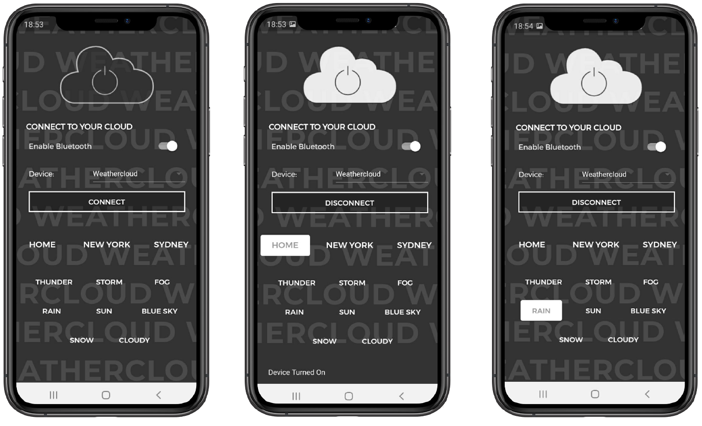
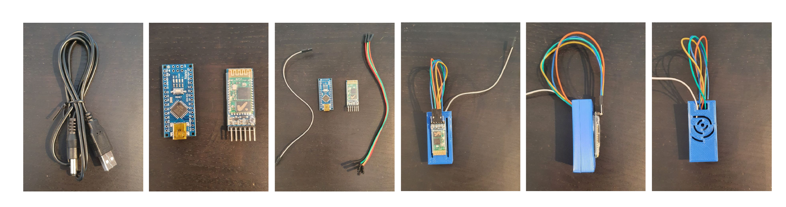

# WEATHERCLOUD
WEATHERCLOUD is a student project developed as part of the elective course **Mediale Inszenierung** under the direction of *Lukas Loss* at the University of Applied Sciences Düsseldorf. The project includes a physical cloud with an LED strip that can visualize the live weather data of different locations. The functionality of the cloud is realized via Arduino and a corresponding Flutter app for Android and iOS. Possible locations, but also individual weather programs can be selected via Bluetooth connection using the app.

Here are some insights of the finished project: https://www.youtube.com/watch?v=pDRxOPgipTM

## CONCEPT
The cloud can be used in both, private and corporate, contexts. The impressive thing about this project is that, conceptually speaking, it does not apply to one specific target group. On the one hand, the cloud can be placed in a living room but also in a child's room, for example as a night light. On the other hand, an installation can be developed in which several clouds are attached in an international company and display the weather data of the different locations. Multiple clouds can also be used as event or store decorations. 

Since the cloud can theoretically visualize any weather situation, it is also suitable for any mood and can be adapted to the appropriate occasion or the desired atmosphere. For this purpose, other color schemes can also be added as desired.

## THE WEATHER
To access live weather data, the API of [wunderground.com](https://www.wunderground.com/) was used. For this, the various icon codes of [*The Weather Company*](https://docs.google.com/document/d/1qpc4QN3YDpGDGGNYVINh7tfeulcZ4fxPSC5f4KzpR_U/edit) of the weather types were considered and clustered. This resulted in a total of **8** groups, which were visualized by different colors and animations:

- Thunderstorm
- Blue Sky
- Storm
- Fog
- Rain
- Snow
- Clouds
- Sun

*Please note:*
The different colors to display the weather were chosen according to personal favor.

## THE APP
Via app the cloud can be controlled. As seen in the image below, the user can choose between 3 locations. **Home** always stands for the actual location tracked via GPS. For now, weather data can be retrieved from **3** different locations and displayed on the cloud:
- Home (your actual location)
- New York
- Sydney
- If desired, the user can also choose the different weather types manually.

## HOW TO BUILD THE WEATHERCLOUD
The following contains a list of materials (hardware and software) as well as instructions to build a weathercloud.

**Materials:**
- Cotton for handicrafts
- Rabbit wires

**Hardware:**
- Arduino (e.g. Nano)
- Bluetooth module (for Android e.g: HC-05, for iOS e.g: AT-09)
- WS2812B LED strip
- 5V USB Cable for soldering and powering of the LED Strip
- Soldering iron
- Powerbank with 2 USB ports

**Software:**
- Arduino IDE ([Windows](https://www.arduino.cc/en/guide/windows#toc1), [macOS](https://www.arduino.cc/en/guide/macOSX)
- Android Studio ([Windows and Mac](https://developer.android.com/studio#downloads))
- Flutter SDK ([Windows](https://flutter.dev/docs/get-started/install/windows), [macOS](https://flutter.dev/docs/get-started/install/macos))

**Instructions**

*Corpus:*
1. With rabbit wires, form the corpus of the cloud as desired
2. Wrap the LED strip around the corpus as desired. 
3. Attach the strip with wires to the corpus that they are fixed and not loose.
4. Add the cotton to hide the leds and to get a look of a cloud

*Arduino and LED:*
1. You have to solder/wire your Arduino. 
2. There are multiple options for the Arduino PINS, in this specific project we used the TX, RX, 5V and GND Pin for the Bluetooth Chip 
3. The D6 Pin is used to control the LED Strip. 
(You can also use other pins for the Bluetooth-Chip, since you will block the upload via USB of the Arduino IDE by using the TX and RX Pin. But if you unplug the cables from TX and RX pin, the upload will work. We suggest to use other digital pins so you can use USB & Bluetooth upload of the Arduino IDE)
4. Solder the 5V and GND Pin to the USB cable
(You could also solder the Arduino to the USB Cable so you don't have to use two cables to power the cloud. You might have an old power adapter which will also work if the voltage fits)

*Functionality and installation:*
1. Install the needed software
2. Clone the repository
3. Copy the adjusted NeoPatterns folder to your Arduino Library
4. Connect the arduino to your computer
5. Upload the custom-neopatterns.ino file to your arduino
6. Disconnect your Arduino from your computer and apply it to the cloud
7. Open the project in Android Studio and connect your phone to your computer
8. Build the project to your phone

*Optional:*
To avoid the Arduino laying directly on the cotton, you can print a case for your Arduino to protect it from damage or dust. The used model for the case, as seen in the picture below, was adopted from Thingiverse and can be downloaded [here](https://www.thingiverse.com/thing:608121).

### WHY FLUTTER?
We used Google's UI toolkit Flutter for building our app. With Flutter you can deploy your application on Android and iOS mobile phones.

## ISSUES
During the development process we experienced some problems.
- It was rather complicated to use the bluetooth functionality in linked pages, so we created a single-paged application for now to control all funcitonalities.
- We weren't able top visualise all colors with the LED strip due to lighting limitations. 
- We used the RX and TX pin for the bluetooth chip which blocked the upload via USB of the Arduino IDE

## SUBSEQUENT DEVELOPMENT
Due to the limited time of the project, there are still a number of options for further development that should be considered. Basically, this options for improvement can be divided into three different areas: the cloud itself, functionality, app design.

**Cloud:**
- When using more or bigger LED stripes, the light distribution could be enhanced
- Diffused light would create a more intense atmosphere, which for example can be realised by optimising the cloud through using more cotton
- It is important to take the stability of the cloud into account, since it will be mounted on the ceiling. The rabbit wire should be fixed with additional wire and the cotton can be fixated into position with hair spray. 
- A consistent power source should be provided (which could be redulated with a flip switch)

**Functionality:**
- Compatibility of multiple clouds (controllable via one device)
- More detailed color schemes
- Smaller "weather groups" to provide more choices
- Search function for any location, like a weather app

**App-Design:**
- Responsive design
- Additional views or split the view:
  - #1: connection via bluetooth
  - #2: control the cloud, choose location
  - #3: choose individual weather regardless of weather data

**Code:**
- Code definitly needs to be refactored
- Custom NeoPatterns has been added and adjusted with code legacys
